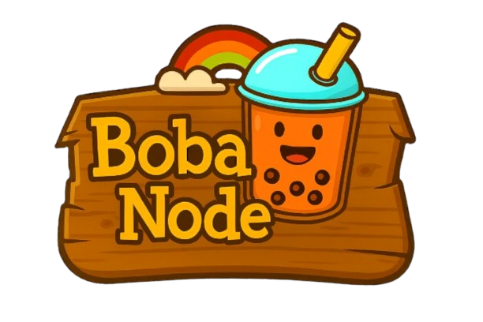

# Boba Node

A simple web interface to generate production-ready Helm charts for blockchain nodes. Stop writing YAML manually and configure your nodes through a clean UI instead.

## What is this?

If you need to deploy blockchain nodes on Kubernetes, you know the pain of managing Helm charts. Boba Node gives you a web UI where you fill in your configuration, click generate, and get a production-ready Helm chart.

Currently supports **BSC**, **Ethereum**, and **Arbitrum** nodes with multiple node type options for each chain.

## Getting Started

```bash
# Install dependencies
npm install

# Start the app
npm run dev
```

Frontend runs on http://localhost:5173, backend on http://localhost:3001.

## How it works

1. **Pick your blockchain**: Choose between BSC, Ethereum, or Arbitrum
2. **Select node type**:
   - BSC: Fast, Full, Archive, or Validator
   - Ethereum: Light, Full, Archive, or Validator
   - Arbitrum: Full, Archive, or Validator
3. **Configure everything** in the web UI:
   - Docker image and repository settings
   - Node configuration (network ID, sync mode, ports)
   - Resource allocations (CPU, memory, storage)
   - Persistence (PVC size and storage class)
   - Monitoring stack (Prometheus, Grafana)
   - Snapshot download for faster sync
   - Validator-specific settings (consensus client for ETH, staker config for ARB)
4. **Generate and download** your production-ready Helm chart
5. **Deploy to your Kubernetes cluster**

The generated charts follow DevOps best practices and include everything you need: StatefulSet, Service, ConfigMap, and proper values files with coherent naming (e.g., `bsc-validator`, `eth-archive-node`, etc.).

## Features

- **Multiple Blockchain Support**: BSC, Ethereum, and Arbitrum
- **Context-Aware Help**: Every field has tooltips that adapt based on your node type
- **Smart Defaults**: Presets for each node type with recommended resources
- **Automatic Naming**: Coherent deployment names, namespaces, and node names based on your selection
- **Modular Architecture**: Clean, maintainable code with reusable components
- **Production-Ready**: Generated charts follow Kubernetes best practices
- **Monitoring Integration**: Built-in Prometheus and Grafana dashboard support
- **Validator Support**: Specialized configurations for validator nodes
- **Snapshot Support**: Quick sync with snapshot downloads

## Project Structure

```
Boba_node/
├── packages/
│   ├── backend/              # Express API for Helm chart generation
│   │   └── src/
│   └── frontend/             # React + TypeScript UI
│       └── src/
│           ├── components/
│           │   ├── common/             # Reusable basic components
│           │   ├── sections/           # Modular configuration sections
│           │   │   ├── bsc/           # BSC-specific sections
│           │   │   ├── eth/           # Ethereum-specific sections
│           │   │   └── arb/           # Arbitrum-specific sections
│           │   ├── HelpTooltip.tsx    # Context-aware tooltips
│           │   ├── NodeTypeModal.tsx  # Node type selection
│           │   └── SectionHeader.tsx  # Section headers with help
│           ├── pages/                 # Main configuration pages
│           ├── types/                 # TypeScript type definitions
│           ├── hooks/                 # Custom React hooks
│           └── utils/                 # Helper functions
└── assets/                   # Images and static files
```

## Roadmap

- [x] BSC nodes (Fast, Full, Archive, Validator)
- [x] Ethereum nodes (Light, Full, Archive, Validator)
- [x] Arbitrum nodes (Full, Archive, Validator)
- [x] Context-aware help tooltips
- [x] Modular component architecture
- [x] Automatic coherent naming
- [ ] Direct kubectl/helm deployment from UI
- [ ] Chart templates customization
- [ ] More blockchain support (Polygon, Optimism, etc.)
- [ ] Advanced networking options
- [ ] Backup/restore configurations

## Tech Stack

- **Frontend**: React 18, TypeScript, Vite
- **Backend**: Express, TypeScript
- **Styling**: CSS with modern animations
- **Build**: Monorepo with npm workspaces

## Contributing

Contributions are welcome! Feel free to open issues or submit PRs.

## License

MIT - do whatever you want with it.

---

**[View on GitHub](https://github.com/Flotapponnier/Boba_node)** | Open source project to easily get started with blockchain nodes
